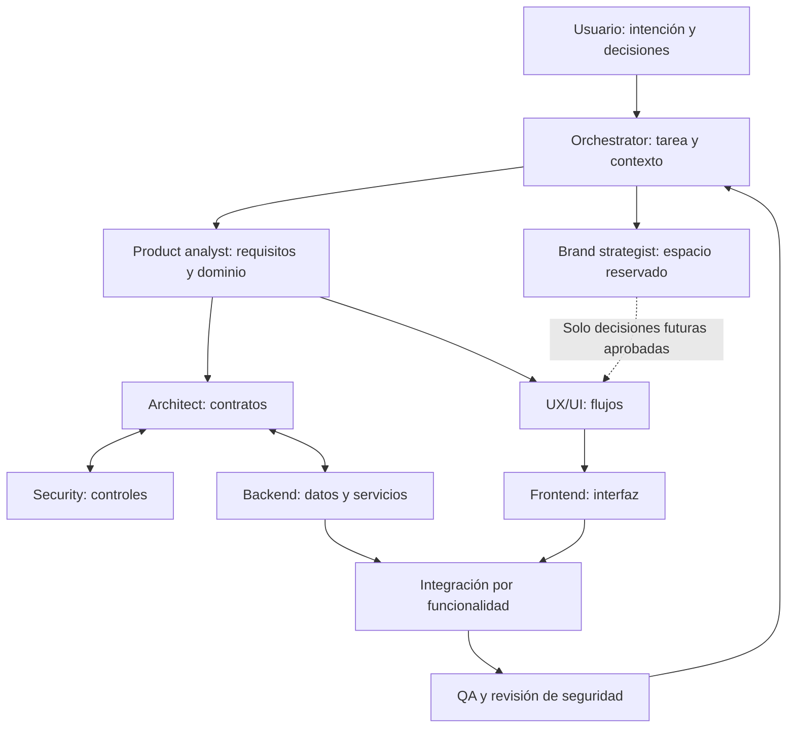

# Protocolo de orquestación

Estado: procedimiento de coordinación de esta base documental. Responsable: orchestrator.

Aplicar el [ciclo SDD](SDD_WORKFLOW.md) a cada entrega. Las tareas de implementación se derivan de una SPEC vigente con plan, criterios de aceptación y dependencias. Para invocar especialistas, utilizar los [perfiles nativos TOML](CODEX_AGENTS.md) cuando la sesión los tenga disponibles; la ficha Markdown continúa como contexto del rol.

## Flujo de trabajo

El gráfico representa responsabilidades, no una orden de lanzar agentes. Seguridad y QA participan desde la definición; sus revisiones no se reservan para el final.

## Contrato de tarea

Crear un encargo con [TASK](../templates/TASK.md): ID, objetivo, responsable, entradas exactas, archivos a modificar, exclusiones, SPEC y versión, criterios de aceptación, dependencias y revisores. Las tareas preparatorias pueden utilizar propuestas si no las convierten en compromisos ni implementación definitiva.

Un paquete habitual incluye las lecturas comunes, una ficha de rol, los requisitos del módulo y sus contratos; no la conversación completa. Si cambia una dependencia, el propietario identifica qué entregables necesitan revisión antes de que otros los consuman.

## Estados

`pendiente → lista → en curso → en revisión → terminada`.

Una tarea puede estar `bloqueada` si identifica una dependencia concreta, responsable de resolverla y trabajo independiente disponible. Una pregunta opcional no bloquea toda la fase. Estos estados son del proyecto y no alteran estados o herramientas del entorno.

## Secuencia y paralelismo

- Producto fija comportamiento; arquitectura, seguridad y UX pueden explorar sobre el mismo alcance explícito.
- Backend y frontend pueden avanzar en paralelo después de acordar contratos y propiedad de archivos. Se integran por funcionalidad.
- QA deriva casos desde requisitos y reglas antes de recibir código.
- La actividad futura de marca queda aislada; solo decisiones aprobadas necesarias pasan a diseño.
- Documentos compartidos tienen un único integrador. No sobrescribir trabajo concurrente; enviar propuestas o dividir archivos.

## Revisión y resolución

1. El responsable entrega archivos y [HANDOFF](../templates/HANDOFF.md).
2. El revisor compara con criterios, identifica defectos concretos y evidencia faltante.
3. El responsable corrige o registra una limitación justificada; el revisor comprueba lo afectado.
4. El orquestador actualiza estado y decisiones. Escala al usuario solo decisiones de alcance/preferencia no resueltas o autorizaciones necesarias.

Producto resuelve semántica financiera; architect integra contratos técnicos; security evalúa controles; UX resuelve interacción dentro de los requisitos; QA aporta evidencia. El orquestador coordina una solución cuando se cruzan dominios, sin cambiar requisitos silenciosamente.

## Gates de calidad

| Gate | Evidencia para avanzar | Revisión |
|---|---|---|
| G1 · Producto | SPEC de la entrega lista, alcance resuelto, reglas críticas y aceptación trazables | product-analyst + orchestrator; usuario en decisiones pendientes |
| G2 · Diseño técnico | Diseño de software, ERD, amenazas y RLS coherentes; contratos del módulo | architect + backend + security |
| G3 · Experiencia | Flujos, estados y criterios de interfaz del módulo | ux-ui + producto + frontend |
| G4 · Implementación | Funcionalidad integrada, revisión y evidencia por criterio de la SPEC vigente | frontend + backend + qa + security según impacto |
| G5 · Entrega | Resultados QA, riesgos resueltos, configuración y recuperación verificadas | orchestrator con especialistas |

Los gates se aplican al módulo o fase pertinente. No requieren una confirmación adicional para cada edición reversible ya autorizada. Desplegar o modificar servicios externos requiere el alcance y la autorización correspondientes; esta documentación no los presupone.
