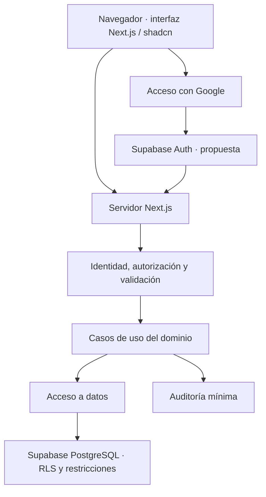

# Diseño de software inicial

Estado: propuesta conceptual, no diseño aprobado ni implementación. Responsable: architect. Entradas: [SRS](../01-product/SRS.md), [reglas](../01-product/BUSINESS_RULES.md), [seguridad](../03-security/SECURITY_REQUIREMENTS.md).

## Restricciones y propuesta

Next.js, shadcn/ui, Supabase y Vercel están elegidos por el usuario. Se propone TypeScript y App Router, lecturas iniciales en servidor, componentes cliente para interacción, una capa de acceso a datos y servicios por dominio. Versiones y APIs concretas deben verificarse al implementar.



La ubicación del servidor Next.js prevista es Vercel. El diagrama representa límites de responsabilidad, no un protocolo OAuth completo. Seguridad y backend definirán callback, cookies, renovación y cierre de sesión en el diseño de autenticación.

## Módulos propuestos

Identidad/perfil, cuentas, tarjetas, movimientos, categorías, ahorro y consultas del dashboard/historial. Presupuestos, metas, recurrencias, analytics, forecasting y alertas se añaden según matriz de producto. Compartir tipos o utilidades no debe eliminar los límites de cada módulo.

## Contratos que deben cerrarse

| Contrato | Contenido requerido | Participantes |
|---|---|---|
| Identidad y sesión | Fuente de identidad, expiración, callback, errores y renovación | architect, security, backend |
| Comando financiero | Entrada, moneda, fecha, propietario, validación e identidad del reintento | producto, backend, frontend |
| Persistencia | Atomicidad, restricciones, claves y reconciliación | backend, architect |
| Consulta | Filtros, paginación, agregados y representación monetaria | backend, frontend |
| Errores | Código estable, mensaje seguro y posibilidad de reintento | frontend, backend, UX |
| Tareas futuras | Identidad de ejecución, alcance por usuario y deduplicación | backend, security |

No son contratos ejecutables todavía. Cada uno requiere ejemplos de entrada/salida y casos de fallo antes de desarrollo dependiente.

## Organización de código propuesta

```text
src/app/                   Rutas y composición de páginas
src/modules/<dominio>/     Componentes, esquemas y casos del módulo
src/components/ui/         Componentes de interfaz
src/components/shared/     Componentes comunes
src/lib/                   Integraciones y utilidades compartidas
src/server/                Acceso a datos y servicios exclusivos de servidor
supabase/migrations/       Cambios de base de datos versionados
```

Estas carpetas no existen todavía. Definir un único propietario del cálculo financiero y límites claros para evitar duplicar reglas entre módulos y `src/server/`.

## Decisiones técnicas pendientes

1. Ledger simple frente a asientos de partida doble; representación de crédito y saldo inicial.
2. Representación exacta de importes y serialización entre base de datos, servidor y cliente.
3. Transacciones atómicas, restricciones de propiedad y política de idempotencia.
4. Auth SSR y gestión de sesiones con Google; RLS en consultas y escrituras.
5. Estrategia de caché, invalidación y frescura de saldos.
6. Jobs, auditoría, snapshots y recuperación cuando su necesidad esté demostrada.

Registrar decisiones duraderas mediante [ADRs](adr/README.md). El diseño debe revisarse con security y backend antes de construir una funcionalidad; no se presupone una arquitectura cerrada para todo el roadmap.
