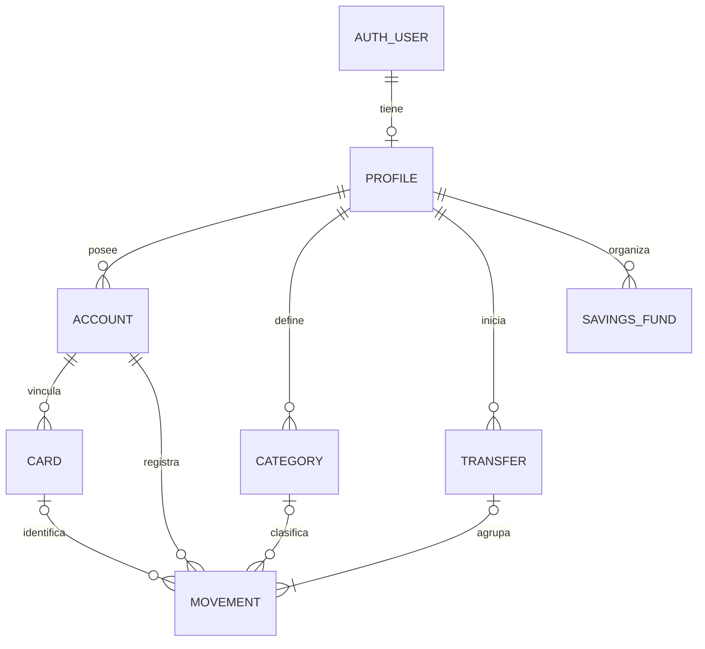

# Modelo entidad-relación conceptual

Estado: propuesta para discusión, sin esquema físico ni migraciones. Responsable: backend; revisores: architect y security.

Las entidades son vocabulario conceptual, no nombres SQL finales. `PROFILE` representa al propietario funcional; en el esquema se decidirá si las claves de propiedad referencian directamente la identidad autenticada. El diagrama permite hablar de entidades sin fijar una política de creación de perfil.

## Relaciones y restricciones pendientes

- Cuenta y tarjeta: precisar crédito frente a débito, deuda, límite y si una tarjeta histórica puede dejar de estar activa.
- Movimiento: cuenta obligatoria; categoría y tarjeta opcionales según tipo. Cualquier referencia debe ser del mismo propietario.
- Transferencia: en el modelo ilustrado agrupa movimientos de origen y destino. Mermaid no expresa aquí exactamente dos efectos; esa regla, atomicidad y signos requieren restricciones y contrato específicos. La alternativa de asientos contables sigue abierta.
- Fondo de ahorro: se deja sin vínculo físico a cuenta hasta resolver si representa una cuenta real, un apartado virtual o ambos.
- El saldo inicial puede ser movimiento o base separada; decidir antes de crear columnas de saldo y consultas.

## Extensiones candidatas

Presupuestos, metas/aportaciones, recurrencias, suscripciones, alertas, proyecciones, snapshots, importaciones y eventos de auditoría aparecieron en la planificación. Se incorporarán según alcance y modelo, con propiedad, ciclo de vida y RLS explícitos. No crear todas las tablas por anticipación.
