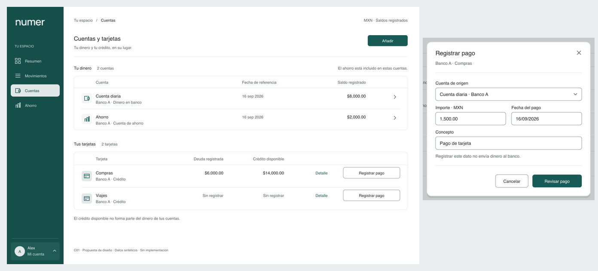

# Numer · UX-DC01 · Composición compacta

Versión 0.3 · 2026-09-16 · T-UX-003 · Responsable UX/UI. **Propuesta para evaluar; no aprobada globalmente ni implementada.** Responde a UX-FB01/02/03. El agente UX/UI nunca modifica frontend ni usa el complemento de Figma. Este documento y sus láminas son recomendaciones para el responsable de implementación.

**UX-FB03:** el usuario valora favorablemente el sidebar actual; pide textos menores y alineados, y mover Ocultar importes/Configuración al dropdown del perfil en la esquina inferior izquierda. Se conserva el panel rectangular de 176 px y se propone la nueva escala inferior. C04 muestra el menú abierto; «Alex» es un perfil sintético, no información del usuario real. La nueva tipografía y el dropdown todavía requieren revisión.

**UX-FB02 — instrucción confirmada del usuario:** favorece la escala compacta de shadcn/ui y pide sidebar rectangular, alineado al borde izquierdo, menos ancho y contenido derecho blanco. Se aplica contorno exterior sin radio ni márgenes, alto completo y fondo principal `#FFFFFF`. Ancho de 176 px propuesto por UX para esta muestra; el usuario no fijó una cifra. La selección interna conserva UX-A01 (38 px/radio 8), distinta del contorno del sidebar. «Se va acercando más» es valoración favorable parcial, no aprobación de todos los componentes ni de la usabilidad.

## Propósito y alcance

Encontrar una cuenta/tarjeta, comparar sus cifras y abrir el registro de un pago sin confundir dinero propio con crédito. Se evalúan una lista y un formulario, no se vuelve a dibujar toda la aplicación antes de comprobar esta dirección. Marca y sidebar UX-A01 se conservan; dimensiones nuevas son propuestas propias de Numer.

| Lámina | Archivo a tamaño real | Qué permite revisar |
|---|---|---|
| C01 · Cuentas | [PNG](assets/ux-003/c01-accounts.png) · [SVG](assets/ux-003/c01-accounts.svg) | Jerarquía, comparación, agrupación, acciones contextuales |
| C02 · Registrar pago | [PNG](assets/ux-003/c02-payment-dialog.png) · [SVG](assets/ux-003/c02-payment-dialog.svg) | Diálogo breve sobre el contexto de origen |
| C03 · Adaptación móvil | [PNG](assets/ux-003/c03-payment-mobile.png) · [SVG](assets/ux-003/c03-payment-mobile.svg) | Una columna, tipografía de captura y blancos táctiles |
| C04 · Perfil / menú abierto | [PNG](assets/ux-003/c04-profile-menu.png) · [SVG](assets/ux-003/c04-profile-menu.svg) | Disparador inferior izquierdo; privacidad/configuración dentro del menú |

Son documentos visuales estáticos; campos y botones dibujados no funcionan. Las medidas se evalúan en los PNG al 100%, no en la vista conjunta reducida. El borde exterior de cada lámina y su pie son del entregable. Iconos de línea esquemáticos; no se propone sustituir el logo o elegir una biblioteca de iconos por esta entrega.

## Cambios que se proponen

| Antes — W02/W04 rechazados | Después — C01/C02 propuestos | Motivo |
|---|---|---|
| Tarjetas grandes para representar cada instrumento | Dos listas con columnas alineadas y filas contenidas | Comparar por atributos; usar un patrón repetible cuando crezca la lista |
| Títulos de 28 px, cifras de 26 px en cada tarjeta | Título de página 18 px/Medium; cifras en filas 13 px | La importancia depende de la tarea, no de hacer grandes todas las cifras |
| Inputs de 46 px y textos de captura de 16 px en desktop | Inputs visuales de 36 px y texto de 13 px | Reducir volumen del formulario; móvil mantiene 44/16 |
| Formulario en un panel de 580 × 610 y ayuda en columna separada | Diálogo de referencia 460 × 434 con ayuda contextual | Acercar campos y acciones; no trasladar esa altura fija a implementación |
| Selector de destino repetido aunque se entra desde una tarjeta | Banco + alias en encabezado, destino contextual explícito | Menos decisiones redundantes; entrada global sí necesita elegir destino |
| Campos alejados y botones grandes al fondo | Grupos de campos; Cancelar y Revisar en el mismo pie | Hacer legible la secuencia de captura sin recorrido visual innecesario |

No se fija una reducción porcentual global. Mantener legibilidad, contenido completo y áreas de interacción. Los 34/36 px describen superficies visuales de escritorio; reservar área de interacción de 44 px cuando sea necesario sin superponer controles. En táctil, controles visibles de 44 px como base propuesta. El sidebar mantiene selección de 38 px/radio 8 dentro de interacción de 44.

## Referencias de patrón verificadas

Consulta: 2026-09-16. Se consultó documentación oficial; no se instalaron componentes ni se adoptó un motor o versión de shadcn/ui.

| Referencia | Hecho documentado | Aplicación propia a Numer |
|---|---|---|
| [Table](https://ui.shadcn.com/docs/components/base/table) | Composición de encabezados, filas/celdas y ejemplo con importes a la derecha | Instrumentos por fila e importes alineados; dinero y crédito en grupos distintos |
| [Field](https://ui.shadcn.com/docs/components/base/field) y [Input](https://ui.shadcn.com/docs/components/base/input) | Etiqueta, control, ayuda y error; agrupación y disposición de campos | Etiqueta persistente, ayuda breve y error junto al campo; importe/fecha lado a lado solo si caben |
| [Dialog](https://ui.shadcn.com/docs/components/base/dialog) | Ventana superpuesta cuyo fondo queda inerte; cabecera, contenido y pie | Captura corta sin perder visualmente el lugar de origen; comportamiento de foco obligatorio |
| [Sheet](https://ui.shadcn.com/docs/components/base/sheet) | Extiende Dialog para contenido complementario desde un borde | Alternativa para un detalle largo; no añadir un panel lateral a toda acción por defecto |
| [Dropdown Menu](https://ui.shadcn.com/docs/components/base/dropdown-menu) | Acciones desde un botón, grupos y elementos de tipo checkbox | Perfil como disparador; Ocultar importes como preferencia con estado y Configuración como destino |

Se toma la estructura, no los ejemplos financieros de esos documentos: Numer no solicita PAN, titular, CVV ni vencimiento. Las medidas de C01–C03 **no se atribuyen a valores predeterminados universales de shadcn/ui**. Emil aporta criterio de coherencia y respuesta directa; no se añaden animaciones para compensar problemas de distribución.

## Anatomía y medidas de referencia

Desktop de referencia: 1280 × 800. Sidebar 176 px desde X=0/Y=0, alto completo, radio exterior 0 y sin separación del marco. Contenido blanco desde el límite del sidebar; sus elementos comienzan en X=208 (32 px de separación interna), margen derecho 36. Las filas no deben crecer para llenar una ventana vacía. El contenido se adapta y desplaza cuando lo necesita.

| Elemento | Referencia propuesta | Regla que debe sobrevivir a cambios de tamaño |
|---|---|---|
| Tipografía | Manrope; título 18/24 Medium, sección/fila/cifra/input 13/20, etiqueta/ayuda/navegación/botón 12/18; título diálogo 17/24 | No reducir fuente para acomodar nombres o importes largos; reordenar o ampliar. Captura móvil mantiene 16 px |
| Dialog | 460 px de ancho, padding 24; altura ilustrativa 434 | Alto según contenido; errores y texto ampliado deben crecer/desplazarse sin recorte |
| Inputs | 36 px visuales desktop; 44 px móvil; radio 6 | Foco perceptible, etiqueta siempre visible, área accionable suficiente |
| Botones | 34–36 px visuales desktop; 44 px móvil; radio 6 | Una acción principal por contexto; superficie de interacción independiente de la visual |
| Filas | 65 px cuentas / 70 px tarjetas como muestra | Soportar alias largo y segunda línea; no fijar una altura que corte contenido |
| Contenedores | Listas radio 10; diálogo radio 12 | Bordes suaves para agrupar; sin envolver cada dato en una tarjeta |
| Ritmo | Escala 4/8/12/16/24/32 | Aproximar dato/etiqueta, separar grupos; espaciado no decorativo |

Petróleo se usa en navegación, acción principal y enlaces; blanco en el área principal según UX-FB02, porcelana como apoyo localizado y niebla en selección. No introducir otro acento de marca. Borde de control propuesto `#85918F`; separador suave es decorativo, no el único indicador de un control. Al abrir un diálogo, la superposición atenúa el fondo blanco mientras el contenido queda inerte; el estado normal de C01 conserva blanco puro.

**Alineación v0.3:** títulos y secciones parten de X=208; dentro de la lista, los iconos ocupan X=232 y nombre/encabezado X=276. Encabezados de importes alineados al mismo extremo derecho que sus cifras. Nombre, fecha, importe y acción comparten línea base principal por fila; banco/tipo quedan en una segunda línea. Esta jerarquía reemplaza el centrado vertical independiente de cada celda. Los grupos no requieren tener todos los textos al mismo eje: icono, dato y metadato conservan columnas explícitas.

## Contrato de interacción propuesto

| ID | Disparador | Resultado esperado / retorno |
|---|---|---|
| UX-DC01-I01 | Cuenta por nombre/enlace o flecha | Abre detalle de esa cuenta. Un enlace principal por fila; no envolver acciones anidadas en otro control. Mantener posición al volver. |
| UX-DC01-I02 | Detalle de tarjeta | Abre detalle para deuda, crédito, meses y fechas. «Sin registrar» no es cero y no oculta acceso al detalle. |
| UX-DC01-I03 | Registrar pago en una tarjeta | Abre C02 con destino explícito. No registrar por abrir; no bloquear por deuda desconocida sin regla de producto. El destino del ejemplo es contextual, no selección oculta. |
| UX-DC01-I04 | Añadir | Elección breve Cuenta / Tarjeta. Conservar el contexto al cancelar. Alta financiera sigue el contrato de producto pendiente. |
| UX-DC01-I05 | Apertura del formulario | Foco al primer control pertinente; título y destino anunciados. Tab contenido en el diálogo; fondo inerte. No abrir un segundo modal para la revisión. |
| UX-DC01-I06 | Revisar pago | Validar primero; error asociado a campo y foco al primero inválido. Si es válido, reemplazar contenido del mismo diálogo por revisión; conservar datos al volver. No envía aún. |
| UX-DC01-I07 | Cancelar / cerrar / Escape | Sin cambios, cerrar y devolver foco al botón que abrió. Con cambios, presentar elección Seguir editando / Descartar dentro del mismo contexto. Clic en fondo no descarta silenciosamente. |
| UX-DC01-I08 | Confirmar desde revisión | Mostrar pendiente, impedir doble envío lógico, esperar resultado real. Éxito, fallo e incertidumbre son estados distintos; conservación de datos depende de contrato de seguridad. |
| UX-DC01-I09 | Activar perfil inferior izquierdo | Abrir menú sobre el disparador, alineado a su borde izquierdo. Ajustar a límites de ventana; no salir del viewport. Nombre accesible del botón incluye perfil; estado expandido anunciado. Flechas recorren opciones; Escape cierra y devuelve foco al perfil. No es un selector de cuentas financieras. |
| UX-DC01-I10 | Ocultar importes / Configuración | Ocultar importes es opción con estado marcado/desmarcado, sin selector anidado independiente; afecta las cifras sensibles del alcance aprobado, también sus equivalentes accesibles. C04 dibuja desmarcado. Mantener menú abierto al alternar para ver estado; Configuración cierra menú y abre ajustes. Persistencia entre sesiones pendiente de producto/seguridad (UX-P12). |

El perfil permanece al final del sidebar; navegación puede desplazarse si falta altura. El menú no reemplaza las cuatro secciones ni agrega configuración al menú principal. En pantallas táctiles cada fila dispone de 44 px; la lámina muestra filas de 48 px. No depende de hover. Configuración conserva el acceso a preferencias/sesión según el alcance que confirme producto; no se diseña aquí un nuevo sistema de cuentas compartidas.

La entrada global desde Movimientos necesita selección de tipo y destino; no sustituirla por el formulario contextual sin adaptarla. «Revisar pago» distingue captura de confirmación; texto de revisión con importe, moneda, fecha, origen y destino. Efectos monetarios se explican solo conforme a la regla acordada por producto.

## Estados y adaptación

| Caso | Recomendación |
|---|---|
| Primera entrada | Un vacío útil por grupo con acción Añadir; no tabla vacía extensa ni ceros inventados |
| Solo una tarjeta sin datos financieros | Identificación visible y «Sin registrar» en cada dato desconocido; acceso a completar en detalle |
| Carga o error parcial | Conservar título, contexto y tamaño aproximado; mensaje/reintento en el grupo afectado; no mostrar cero como carga |
| Error de campo | Texto breve debajo, sin depender de color; espacio crece y no empuja acciones fuera de alcance |
| Resultado incierto | Explicar que falta confirmación; consultar la misma operación según contrato. No pedir crear otro pago |
| Texto al 200% o alias largo | Dos líneas o disposición vertical; se conserva importe completo, moneda y acción |
| Menos de 640 px como hipótesis inicial | Captura ocupa ancho disponible, una columna, campos 44 px/16 px. Validar punto de cambio por contenido, no por dispositivo supuesto |
| Teclado virtual / pantalla baja | Formulario con desplazamiento; acciones al final del flujo y accesibles. No pie fijo que tape el campo enfocado |
| Lista de cuentas en móvil | Instrumento y saldo en una fila adaptable; metadatos debajo; tarjetas apilan deuda/crédito con sus etiquetas. Esta variante de C01 aún no está dibujada |
| Movimiento reducido | Cambios de estado inmediatos; sin interpolación de importes. Animación no necesaria para validar esta fase |

C03 no prueba teclado real, foco ni zoom. Tampoco aprueba cambiar la navegación global móvil; representa únicamente la tarea de captura.

## Supuestos y decisiones de producto

Mismos datos sintéticos que T-UX-002: Banco A, alias Compras/Viajes, dinero 8,000 + ahorro 2,000, deuda 6,000 y crédito disponible 14,000. No añadir deuda/crédito al total de dinero. Moneda MXN y fecha son ilustrativas. «Registro sin enviar dinero» sigue pendiente de confirmación UX-P01; no hay integración bancaria o pago ejecutado. Ahorro como cuenta sirve solo de escenario; UX-P08 sigue pendiente. Público, origen manual/importación, saldo inicial y reglas de deuda/corte/meses no se deciden dibujando.

## Revisión guiada de esta fase

Orden de revisión: C01 a tamaño real → C02 → C03. Sin explicar controles, plantear:

1. Localiza la deuda de Compras y explica qué significa «Sin registrar» en Viajes.
2. Indica dónde comenzarías a registrar un pago de Compras y cuál sería el destino.
3. En C02, señala qué puedes cambiar y qué esperas que suceda al pulsar Revisar pago.
4. Explica si crédito disponible forma parte del dinero de tus cuentas.
5. Evalúa densidad y legibilidad al 100%; señalar elementos concretos, no solo «moderno» o «grande».

Registrar hallazgo y evidencia en [registro de revisión](REVIEW-UX-003.md). Cualquier confusión dinero/crédito, destino o confirmación requiere cambio antes de ampliar pantallas. Esta revisión con el promotor no equivale a validación con usuarios representativos. La aceptación de esta dirección tampoco autoriza frontend a este agente.
