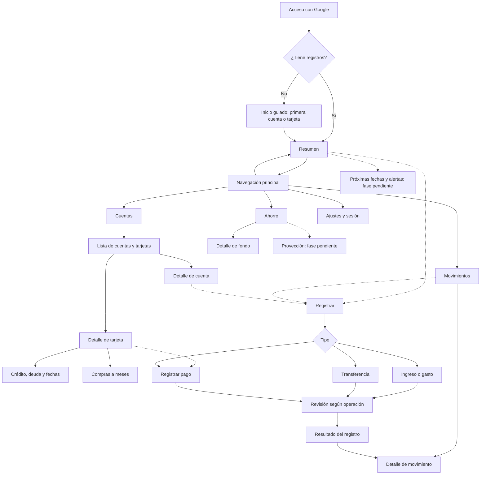

# Numer · Arquitectura de información y navegación

**Actualización UX-FB03 / UX-DC01 v0.3:** en escritorio, Configuración y Ocultar importes se acceden desde el menú del perfil anclado abajo a la izquierda. Configuración corresponde al destino UX-N14 ya previsto; privacidad es una opción con estado, no un nuevo destino. Los cuatro destinos principales se mantienen. Ver [composición e interacción](COMPACT_DESIGN.md).

Versión 0.1 · 2026-09-16 · Responsable UX/UI · T-UX-002 · Estado: propuesta. UX-A01 aprueba solo la selección del sidebar, no todo el mapa. Referencias: [flujos](USER_FLOWS.md), [pendientes](UX_REVIEW.md), [wireframes](WIREFRAMES.md).

## Mapa principal

[Versión resumida editable en FigJam](https://www.figma.com/board/iFDAZcS4HOnjp4O13nlnDt). El diagrama inferior conserva el detalle completo y los accesos contextuales. Ambos son propuestas, no rutas implementadas.

Línea sólida: jerarquía de pantallas propuesta. Línea discontinua: acceso contextual o capacidad cuya fase está pendiente. «Registrar» es una acción; no es un quinto destino de navegación.

## Contrato por pantalla

IDs de diseño, no rutas Next.js. Destinos conservan una sola selección principal activa.

| ID | Pantalla / padre | Entradas y acción principal | Salida / contexto que conserva |
|---|---|---|---|
| UX-N01 | Acceso / público | Google; ayuda sobre datos | Retorno seguro al espacio propio; fallo permite reintentar |
| UX-N02 | Inicio guiado / Resumen | Añadir primera cuenta o tarjeta; consultar qué datos se requieren | Primer detalle; progreso real, sin tour obligatorio |
| UX-N03 | Resumen | Periodo, dinero, deuda, gasto, ahorro incluido; Registrar | Indicador abre su fuente y mismo periodo |
| UX-N04 | Movimientos | Periodo, buscar concepto y filtros; Registrar | UX-N05; regreso restaura filtros y posición |
| UX-N05 | Detalle / Movimientos | Tipo, moneda/fecha, origen/destino, fuente y efecto | Volver; correcciones solo tras UX-P10 |
| UX-N06 | Cuentas | Dos grupos: dinero y tarjetas; Añadir | UX-N07/08; contar instrumentos sin sumar dos veces |
| UX-N07 | Cuenta / Cuentas | Dinero registrado, fecha de referencia e historial; Registrar | Historial filtrado y vuelta al mismo registro |
| UX-N08 | Tarjeta / Cuentas | Banco + alias, deuda, crédito, fechas, meses; Registrar pago | UX-N09/11; concepto de pago explícito |
| UX-N09 | Compra a meses / Tarjeta | Plan, fechas, cuotas previstas, movimientos vinculados | Regreso a tarjeta; editar pendiente de política |
| UX-N10 | Captura / acción contextual | Tipo → campos necesarios → revisión cuando corresponda | Cancelar conserva contexto; cambios sin enviar requieren elección |
| UX-N11 | Revisión / Captura | Pares etiqueta/valor; efecto; Registrar | Volver a datos o resultado; no asumir guardado al cerrar |
| UX-N12 | Ahorro | Fondos y procedencia; añadir según modelo | UX-N13; metas condicionadas al alcance |
| UX-N13 | Fondo / Ahorro | Apartado o cuenta según regla; aportaciones/retiros | Fuentes; sin duplicar patrimonio |
| UX-N14 | Ajustes | Apariencia, ocultado, sesión; preferencias aprobadas | Mismo contexto; cerrar sesión elimina vista protegida |
| UX-N15 | Evento/estimación / contextual | Origen, fecha, condición/supuestos | Registro relacionado; no crea automáticamente hechos |

## Reglas de orientación y recuperación

- Escribir «Cuentas y tarjetas» dentro de UX-N06; probar si «Cuentas» basta en navegación. Alternativa de etiqueta, pendiente de prueba: «Cuentas y tarjetas» en dos líneas sin reducir fuente.
- Profundidad: menú global de un nivel; niveles interiores mediante título, volver y contexto. En escritorio, lista/detalle puede convivir si hay espacio; no generar un árbol de tarjetas en el sidebar.
- Navegación estable en escritorio y móvil. El sidebar aprobado conserva su selección de 38/8/44. La posición móvil superior actual se mantiene como base; barra inferior es alternativa de investigación, no decisión aplicada.
- Carga conserva ubicación. Un error dentro de tarjeta no obliga a regresar a Resumen. Volver del detalle conserva periodo/filtros. Recargar o entrar por enlace requiere contrato de sesión y permisos posterior.
- Global «Registrar» pregunta tipo; desde una cuenta propone ese origen de forma visible/editable. Desde tarjeta, «Registrar pago» propone ese destino. Ningún valor inferido confirma una operación.
- Categorías viven en análisis/filtros y su gestión futura en ajustes; no requieren un destino global ahora. Alertas y proyecciones no llenan el menú antes de confirmar fase.
- Si el filtro está activo, mostrar el alcance de los totales. Al cambiar periodo, la fuente y su indicador deben ser consistentes.

## Prueba de encontrabilidad propuesta

Sin enseñar este mapa, pedir: encontrar deuda de una tarjeta, revisar transferencia, registrar pago, localizar ahorro y ocultar importes. Registrar primer destino elegido, retrocesos y explicación del usuario. Probar primero «Cuentas»; si se confunde con ausencia de tarjetas, comparar etiqueta extendida. No existe resultado de tree testing aún.
