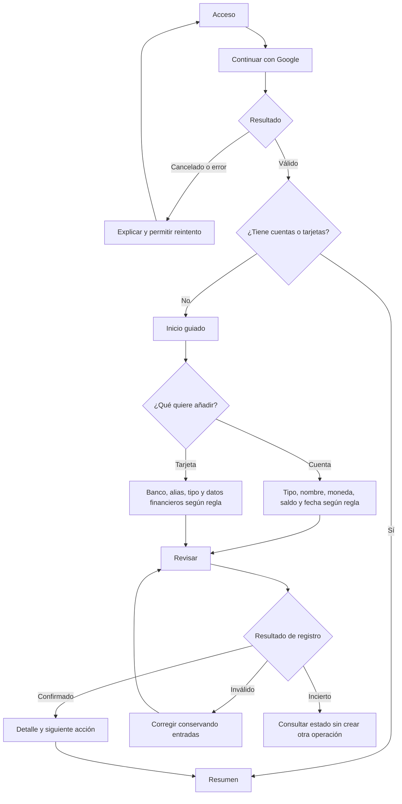
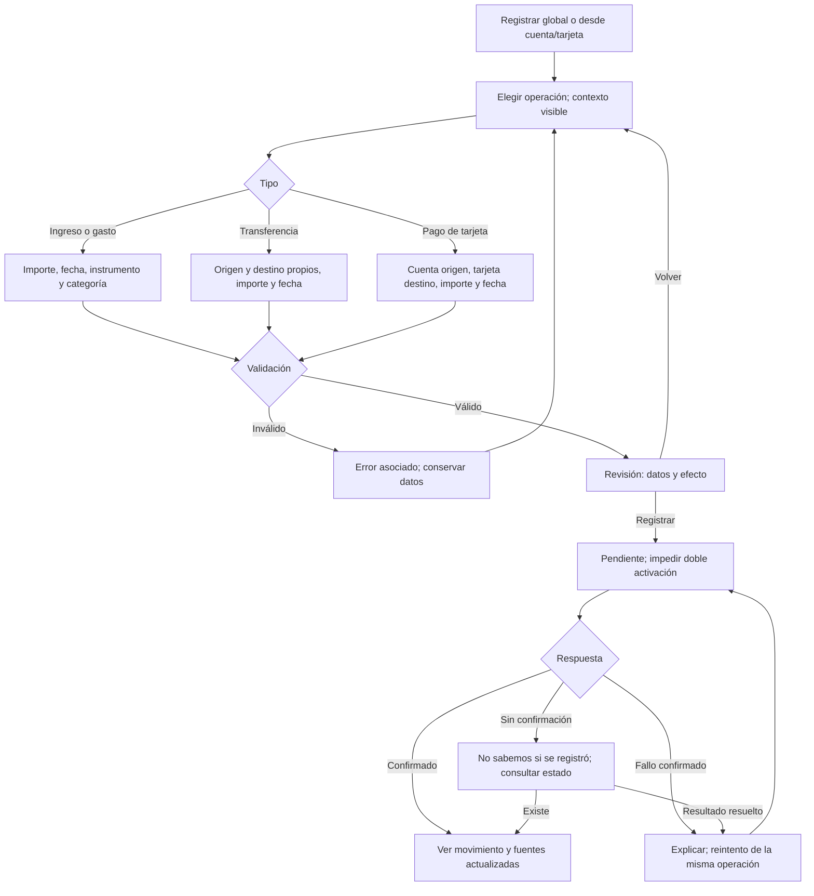
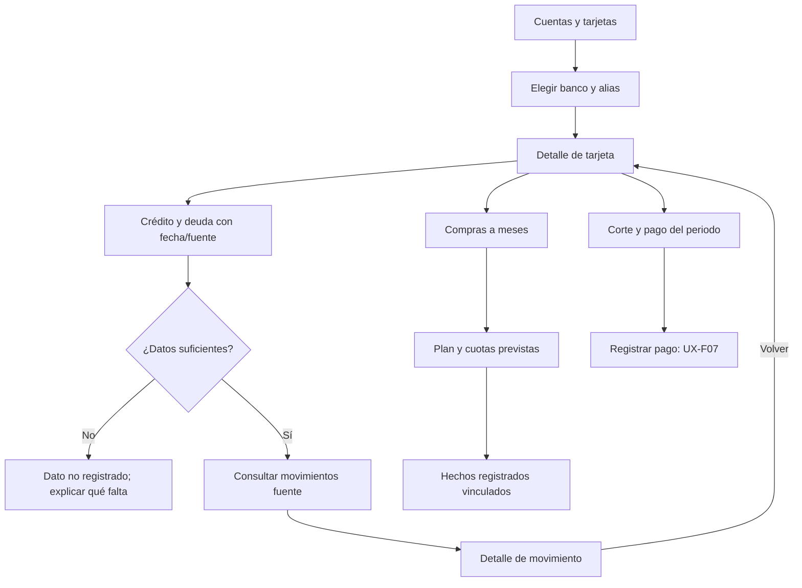

# Numer · Flujos y estados

**Actualización UX-FB03:** acceso desktop a privacidad y configuración desde el dropdown de perfil inferior izquierdo. UX-F13 conserva su finalidad; entrada/estado/foco se concretan en UX-DC01-I09/I10 de [COMPACT_DESIGN](COMPACT_DESIGN.md). La ubicación nueva no resuelve persistencia entre sesiones ni permisos pendientes.

Versión 0.3 · 2026-09-16 · Responsable: ux-ui · [T-UX-001](T-UX-001.md), UX-AC-02.

Estado: recorridos propuestos, sin implementación ni SPEC funcional lista. [SRS](../01-product/SRS.md) y [reglas](../01-product/BUSINESS_RULES.md) conservan su estado propuesto. BR-C26/27/28 son instrucciones confirmadas; dependencias en [revisión](UX_REVIEW.md). La identidad aprobada se aplica según [sistema](DESIGN_SYSTEM.md).

## Arquitectura de información propuesta

| Destino | Contenido | Relación |
|---|---|---|
| Resumen | Dinero en cuentas, deuda separada, ahorro identificado, gastos por periodo | Cada indicador lleva al detalle/historial que lo explica, conservando ámbito y periodo. Estimaciones en bloque separado si entran al alcance. |
| Movimientos | Historial, filtros, detalle y Registrar | Operación determina campos; categorías desde filtros/análisis, sin destino global adicional por defecto. |
| Cuentas | Listas separadas de cuentas y tarjetas, alta/detalle | Etiqueta breve en sidebar; título interior «Cuentas y tarjetas». Crédito, meses, corte y pagos dentro de cada tarjeta. |
| Ahorro | Fondos, detalle, movimientos asociados | Metas solo si se incluyen; no repetir ahorro como activo adicional. |
| Ajustes, fuera del grupo financiero | Sesión, apariencia, privacidad y preferencias aprobadas | Tema/ocultado pueden seguir en el pie. «Espacio personal» no implica selector multiusuario. |

Calendario, alertas, presupuestos y proyecciones dependen de UX-P11. Prever entradas contextuales desde resumen/tarjeta/ahorro; no añadir destinos vacíos. Conservar las cuatro secciones es una propuesta de navegación, no aprobación de MVP.

## Recorridos necesarios

| ID | Entrada → pasos → salida | Variantes y recuperación | Trazabilidad / dependencias |
|---|---|---|---|
| UX-F01 · Acceder | Acceso → Google → retorno → espacio propio/configuración | Cancelación, fallo, denegado, sesión vencida, cierre; retirar datos de otra sesión. | RF-01, DEC-002; UX-P02/12 |
| UX-F02 · Primera cuenta | Resumen vacío/Cuentas → añadir → tipo, nombre, moneda, saldo/fecha inicial según modelo → revisar → confirmar → detalle | Sin cuentas; saldo desconocido distinto de cero; error/reintento; añadir otras cuentas. | RF-02, RN-01/02; UX-P03/04/05 |
| UX-F03 · Añadir tarjeta | Cuentas → tarjetas → banco/icono, alias propuesto y tipo → relación con cuenta → datos de crédito/corte según contrato → revisar → detalle | Varias del mismo banco, icono ausente con nombre legible, deuda no informada. Sin PAN, titular, CVV, PIN, vencimiento ni credenciales bancarias. | RF-03, BR-C26/27/28; UX-P05/06/07 |
| UX-F04 · Ingreso/gasto | Registrar contextual → tipo → concepto, importe/moneda, fecha, cuenta/instrumento, categoría según tipo → revisión → envío → detalle | Gasto con saldo y compra a crédito como ramas distintas; meses remite a UX-F08. Sin cuenta elegible, inválido, doble envío, resultado incierto. | RF-04, RN-01/04/05/06; UX-P03/04/06 |
| UX-F05 · Transferir | Registrar → transferencia → origen/destino propios → importe/fecha → revisar ambos efectos → confirmar → detalle enlazado | Misma cuenta, monedas distintas sin regla, comisión no definida, fallo sin efecto parcial, reintento único. | RF-05, RN-03/04; UX-P03/05 |
| UX-F06 · Consultar crédito | Cuentas → tarjeta → deuda, límite, utilizado, disponible, uso %, meses, corte/pago → fuentes | Desconocido, desactualizado, deuda cero confirmada e incoherencia son estados distintos; utilizado no equivale automáticamente a deuda al corte. | BR-C28, RF-03/07, RN-06/08; UX-P06/07 |
| UX-F07 · Registrar pago | Tarjeta/Registrar → cuenta origen, tarjeta destino → importe/fecha efectivos → efectos → envío → detalle | Parcial/total/excesivo según política; no registrar pago como otra compra; éxito tras confirmación. | RF-04, RN-04/06, BR-C28; UX-P01/06/07 |
| UX-F08 · Compra a meses | Compra a crédito → modalidad → datos de plan según producto → revisión → detalle de cuotas previstas y hechos registrados | Meses, intereses/comisiones, inicio y redondeo por definir; cuota prevista no significa pago ejecutado; correcciones/devoluciones dependen de política. | BR-C28, RN-06/08; ampliar SRS; UX-P06/07/10 |
| UX-F09 · Consultar/análisis | Resumen/Movimientos → periodo → filtros de tipo/cuenta/tarjeta/categoría según alcance → lista → detalle → volver | Conservar filtros/posición; carga, vacío inicial, cero coincidencias, error parcial; paginación según volumen pendiente. Ámbito de totales explícito. | RF-06/07, RN-05; UX-P03/09 |
| UX-F10 · Ahorro | Ahorro → crear/abrir fondo → origen y asignación → aportar/retirar según modelo → revisión → detalle | Cuenta: UX-F05; apartado: reasignación según regla. No elegir silenciosamente ambos modelos. | RF-08/09, RN-07; UX-P08 |
| UX-F11 · Corregir | Detalle → acción permitida → original/corrección y efectos → confirmar → historial trazable | Cancelar, conflicto con cambios recientes, devolución parcial y cuotas afectadas; política pendiente. | RN-02/05/06, Q-08; UX-P10 |
| UX-F12 · Fechas/alertas/proyección | Resumen/tarjeta/ahorro → evento/estimación → periodo, fuente/supuestos → hecho relacionado o registrar | Previsto, vencido según regla, leído/descartado, datos insuficientes/desactualizados. Previsión no se materializa silenciosamente en hecho. | RF-10/11/12, RN-08/09/10; UX-P07/11 |
| UX-F13 · Preferencias/sesión | Pie/Ajustes → ocultado/tema/preferencia disponible → respuesta → volver/cerrar sesión | Ocultar cifras, gráficos, detalles y texto accesible; exportación/eliminación/MFA solo según alcance. | RF-01, RNF-03/04, F-15; UX-P12 |

## Captura propuesta

Entrada contextual → elegir operación → capturar → revisar → enviar → registro confirmado → detalle. Revisión especialmente útil para transferencias, crédito y pagos; su obligatoriedad en registros ordinarios debe probarse antes de fijarla. Presentar concepto, importe/moneda, fecha, origen/destino e impacto en pares etiqueta/valor. Volver conserva entradas. Botón final «Registrar movimiento» o «Registrar pago», según acción. La maqueta actual termina en «Cerrar vista previa» y no representa este guardado.

## Estados transversales propuestos

| ID | Situación | Presentación y recuperación |
|---|---|---|
| UX-E01 | Carga | Mantener contexto y comunicar carga; no cifras falsas ni ceros temporales. |
| UX-E02 | Sin registros | Explicar qué falta y ofrecer Añadir cuenta/tarjeta o Registrar según contexto. Deuda desconocida no es cero. |
| UX-E03 | Sin coincidencias | Conservar periodo/filtros, explicar y permitir limpiarlos; distinto de no tener registros. |
| UX-E04 | Campo inválido | Error junto al campo y asociado accesiblemente; foco en resumen de errores o primer inválido al enviar; conservar resto. |
| UX-E05 | Envío pendiente | «Registrando…», evitar doble activación y mantener lectura estable. Deshabilitar botón no sustituye idempotencia del servidor. |
| UX-E06 | Confirmado | Mensaje breve solo tras persistencia confirmada, fuentes actualizadas y «Ver movimiento». |
| UX-E07 | Fallo confirmado | Error específico/reintento seguro; conservar entradas durante sesión autorizada. Error de un bloque no borra los demás. |
| UX-E08 | Incierto/sin conexión | «No pudimos confirmar el registro»; consultar estado/reintentar misma operación según contrato. No afirmar fallo ni crear un envío nuevo; no prometer offline. |
| UX-E09 | Sesión vencida/sin acceso | Retirar información protegida y dirigir a acceso. Recuperación de borrador solo según política de seguridad; no garantizar almacenamiento local. |
| UX-E10 | Desconocido/desactualizado/conflicto | Fuente/fecha cuando existan, limitación y actualizar/recargar; revisar datos actuales antes de repetir corrección. |

## Interacción y adaptación

- Navegación de página con enlaces y `aria-current="page"`; acciones con botones. Detalle conserva filtros y devuelve foco al disparador al cerrar.
- Móvil: un campo por fila; revisión etiqueta/valor y diálogo/página adaptado a teclado y altura útil, no aceptado solo por captura completa.
- Diálogo: nombre accesible, foco lógico/contenido, Escape y retorno. Ante cambios sin enviar, continuar/descartar sin pérdida silenciosa.
- Moneda, fecha, tipo y estimación explícitos por texto; no depender solo de color/signo. Movimiento reducido mantiene información y acciones; sin contadores de cifras ficticias.
- Ocultar importes también en tooltips, texto accesible, gráficos y detalle. Este control visual no acredita seguridad del servidor.

Criterios medibles en [sistema](DESIGN_SYSTEM.md). QA ejecutará escenarios cuando exista prototipo/aplicación apropiados. Versión 0.2 amplía el borrador con marca aprobada, crédito solicitado y dependencias; no aprueba reglas o fases.

## Ampliación T-UX-002 · diagramas de recorridos prioritarios

2026-09-16. Complementa inventario anterior; propuestas de comportamiento dependientes de UX-P01 a UX-P12. IDs de pantalla en [navegación](NAVIGATION.md). Los importes de wireframes son sintéticos.

### UX-F01/02/03 · Acceso y primer registro

### UX-F04/05/07 · Captura, revisión y recuperación

El diagrama representa el recorrido con revisión. Para gastos ordinarios, retirar ese paso es una alternativa que debe probarse; no aplicar esa simplificación automáticamente a transferencias/pagos. Consultar estado/reintentar exige un contrato de idempotencia; ningún wireframe implementa esa capacidad.

### UX-F06/08/09 · Consulta y obligaciones

Corte, pago del periodo y proyección se etiquetan con el concepto exacto cuando producto lo defina. Un estado «vencido» requiere fecha/regla verificadas; ausencia de pago registrado no acredita que un banco no lo haya recibido.
