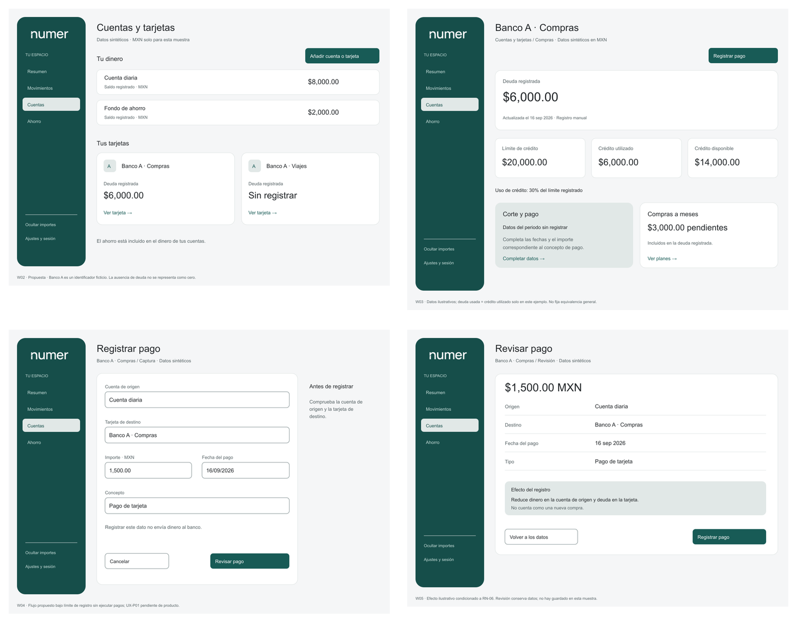

# Numer · Wireframes 0.1

**Estado vigente: composición rechazada por el usuario — [UX-FB01](UX-FEEDBACK-001.md).** Escala de textos/inputs, formas y distribución requieren rediseño. Conservar paleta y contenido. Los diez marcos y su ZIP son antecedentes, no referencia visual para frontend. No continuar el acabado en Figma: el usuario prohibió volver a usar el complemento. La evidencia de renderizado inferior es histórica y no acredita aceptación.

2026-09-16 · UX/UI · T-UX-002. Diez marcos estáticos: ocho de escritorio y dos de móvil. Propuestos, con datos sintéticos; no son frontend ni prototipo funcional. Disponibles en SVG/PNG y [Figma](https://www.figma.com/design/tTqlU8S1gc4AvW9BdPOuI6). La selección de escritorio 38/8/44 incorpora UX-A01.

## Revisión visual

## Inventario y recorrido

| ID | Pantalla | SVG editable / imagen | Flujo y salida propuesta |
|---|---|---|---|
| W01 | Acceso e inicio | [SVG](assets/ux-002/w01-access.svg) · [PNG](assets/ux-002/w01-access.png) | UX-F01; tras acceso → W09 o W10 según elección |
| W02 | Cuentas y tarjetas | [SVG](assets/ux-002/w02-accounts.svg) · [PNG](assets/ux-002/w02-accounts.png) | UX-F02/03/06; elegir tarjeta → W03; añadir → W09/W10 |
| W03 | Detalle de tarjeta | [SVG](assets/ux-002/w03-card.svg) · [PNG](assets/ux-002/w03-card.png) | UX-F06/08; registrar pago → W04; meses → detalle por diseñar |
| W04 | Captura de pago | [SVG](assets/ux-002/w04-payment.svg) · [PNG](assets/ux-002/w04-payment.png) | UX-F07; revisar → W05; cancelar → W03 con control de cambios |
| W05 | Revisión | [SVG](assets/ux-002/w05-review.svg) · [PNG](assets/ux-002/w05-review.png) | UX-F07; volver → W04; éxito real → W06; incierto → estado W08 |
| W06 | Historial filtrado | [SVG](assets/ux-002/w06-movements.svg) · [PNG](assets/ux-002/w06-movements.png) | UX-F09; detalle conserva periodo/filtro al volver |
| W07 | Tarjeta móvil | [SVG](assets/ux-002/w07-mobile-card.svg) · [PNG](assets/ux-002/w07-mobile-card.png) | Variante UX-F06; jerarquía vertical sin sumar crédito y dinero |
| W08 | Resultado incierto móvil | [SVG](assets/ux-002/w08-mobile-uncertain.svg) · [PNG](assets/ux-002/w08-mobile-uncertain.png) | UX-E08; consultar misma operación o volver a historial |
| W09 | Primera cuenta | [SVG](assets/ux-002/w09-add-account.svg) · [PNG](assets/ux-002/w09-add-account.png) | UX-F02; revisión → éxito → W02, sin asumir persistencia |
| W10 | Identificar tarjeta | [SVG](assets/ux-002/w10-add-card.svg) · [PNG](assets/ux-002/w10-add-card.png) | UX-F03; continuar a datos financieros según contrato |

Las flechas son especificación de conexiones para un prototipo posterior, no enlaces que funcionen en los SVG. Alias «Compras»/«Viajes» y «Banco A» son sintéticos. Los marcos son independientes: W02/W03 representan antes del pago ilustrativo; W06 muestra el historial tras un pago confirmado; W08 es rama alternativa de resultado incierto. Sus totales no forman un libro contable completo conciliado.

## Anotaciones para revisión

- Campos, valores y opciones financieras son propuestas sujetas a UX-P03–P07. MXN no queda aprobado por dibujarlo.
- W03 usa deuda y crédito utilizado iguales solo como ejemplo; no define equivalencia general. Los $3,000 a meses están incluidos en la deuda de ejemplo, no se suman aparte.
- W04/W05 presuponen registro sin ejecución y regla RN-06 para ilustrar recorrido. Producto debe confirmarlas. No indicar éxito si el servidor no confirma.
- El importe/concepto de pago del periodo está sin completar en W03; no sustituirlo por pago mínimo o mensualidades sin definición.
- W09 no define cómo guardar un saldo desconocido. Ese tratamiento depende de producto; el texto impide sustituirlo silenciosamente por cero.
- W10 cubre identificación; campos finales de crédito, corte, mensualidades y pago quedan dependientes de las reglas de producto.
- Wireframes simplifican iconos para centrar revisión en jerarquía. La especificación mantiene icono + etiqueta como objetivo del componente definitivo.
- Móvil conserva la navegación superior por continuidad; su geometría 48/52 aún se propone. No se aprobó barra inferior ni se probaron alturas de teclado mediante una imagen.

## Cobertura restante

Alta de deuda/meses completa, detalle de movimiento, transferencia, gasto/ingreso, resumen ampliado, ahorro, proyecciones, alertas y ajustes tienen mapa/flujo/casos pero no marcos nuevos completos en esta entrega. Sus reglas/fase deben resolverse antes del prototipo integral. Error de campo, carga, vacío, éxito y sesión vencida están especificados en UX-E01–E10; no se presentan como pantallas ya probadas.

## Figma y edición

Los diez SVG se importaron en Figma como texto y geometría editables. Se comprobó Manrope y se inspeccionó cada captura. Logo incrustado corresponde al maestro 1.0; las anotaciones de pie pertenecen al entregable, no a la interfaz productiva. Sin auto layout, variables, componentes reutilizables o enlaces de prototipo todavía.

[Paquete local de wireframes y tokens](assets/ux-002/numer-ux-wireframes-0.1.zip) · [Mapa editable en FigJam](https://www.figma.com/board/iFDAZcS4HOnjp4O13nlnDt) · [Nodos y enlaces individuales](assets/ux-002/figma-manifest.json).

**Límite de Figma:** el importador normalizó pesos a Regular; 41 textos se corrigieron y 66 quedan por restituir a Medium. W04 y W05 se superponen en el lienzo: mover W04 (nodo `2:2`) a X=100, Y=1100. El límite MCP del plan Starter detuvo ese acabado. La revisión local SVG/PNG está completa; no afirmar fidelidad final completa del archivo Figma. Los enlaces individuales permiten inspeccionar cada marco.

## Validación

Renderizado SVG→PNG con Sharp del runtime disponible e inspección visual. Se corrigió un solapamiento de texto en W01 y se convirtió una falsa apariencia de campo en indicador del siguiente paso en W10. Diez SVG con títulos/descripciones y límites básicos de texto comprobados por generador. Esto no prueba teclado, lector de pantalla, responsividad real, aceptación financiera o persistencia. Evidencia en [informe](verification/T-UX-002.json).
